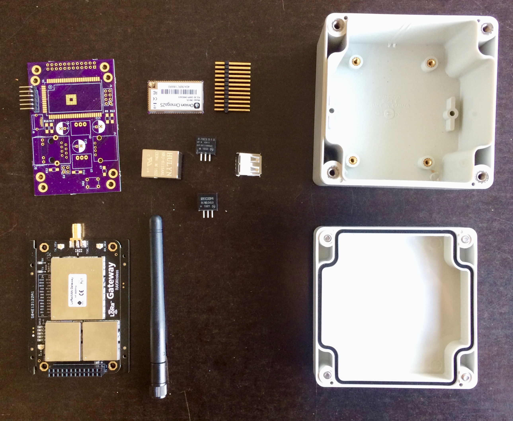
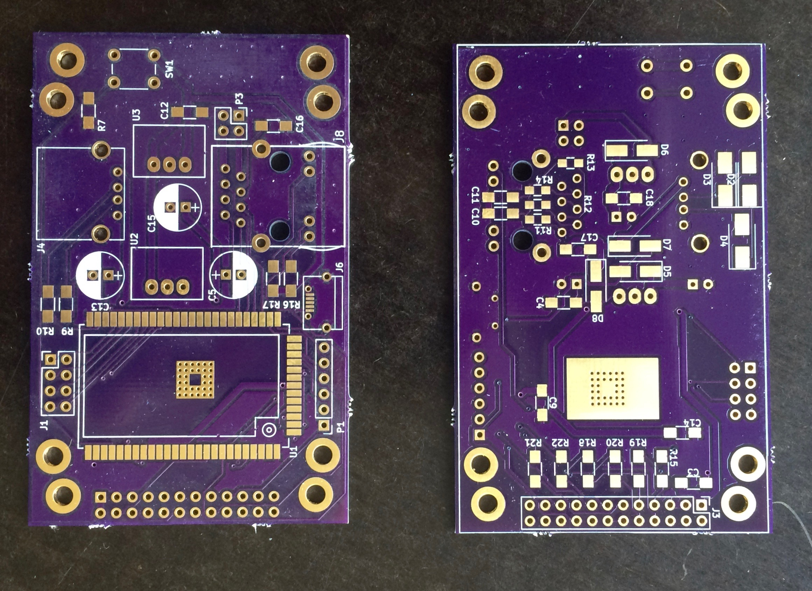
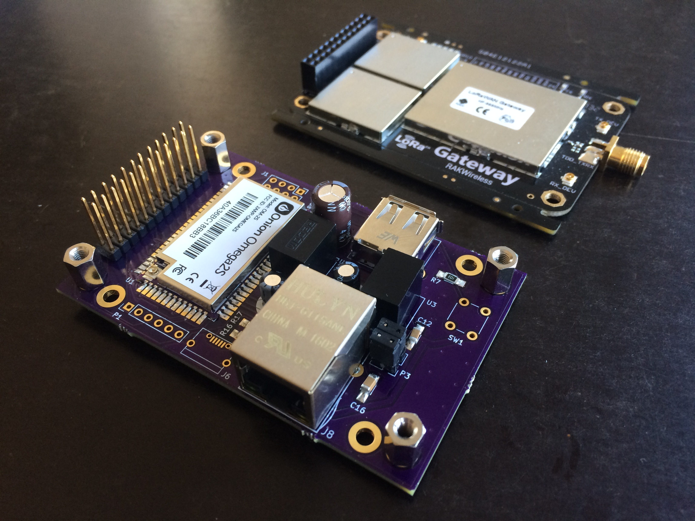
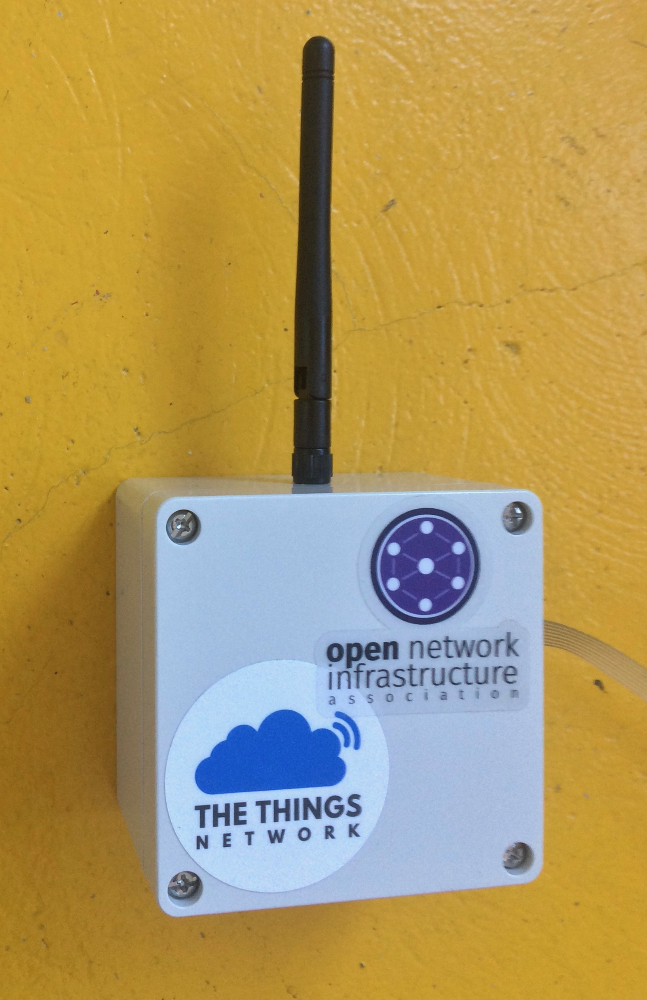
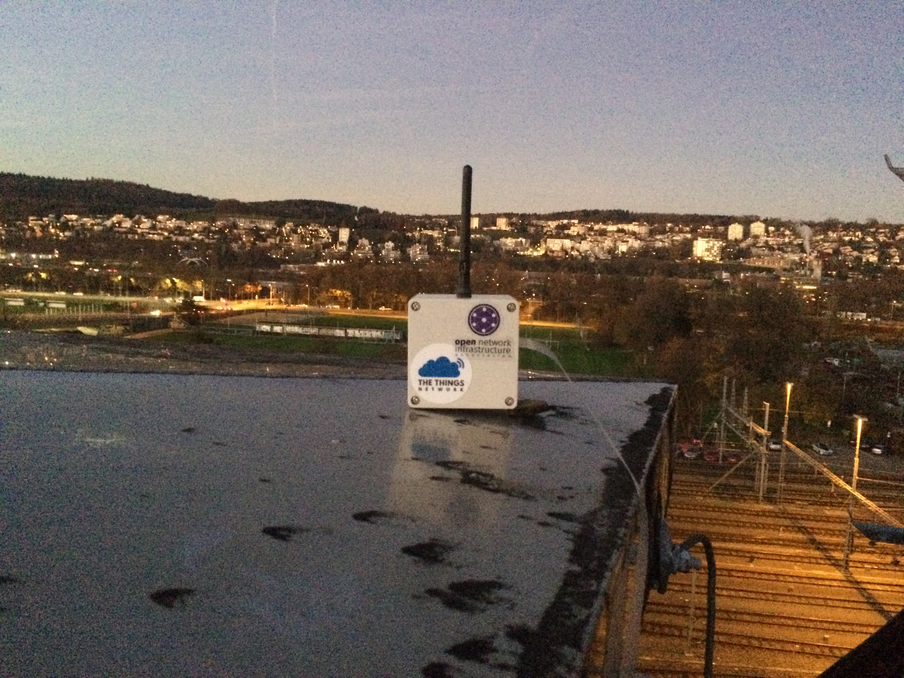

# p44ttngw hardware

This repository contains the KiCAD CAE files for a RAK831 + Omega2S based TTN LoRa gateway. This PCB can be sandwitched with a RAK831 LoRa concentrator board and fits into a 90*90*60mm IP65 watertight Hammond 1554EGY enclosure.

The firmware for the project (a customized LEDE build) is contained in the plan of the plan44-feed LEDE feed repository in the [p44ttngw-config package](https://github.com/plan44/plan44-feed/tree/master/p44ttngw-config), see [README there](https://github.com/plan44/plan44-feed/blob/master/p44ttngw-config/README.md) about how to build the firmware image from scratch.

The resulting image can be installed on a Omega2 or Omega2S and will start to act as a TTN gateway after powerup.

You can order the board (actually, 3 of them) directly from [OSH Park](https://oshpark.com/shared_projects/YRz3oTv7) or of course use the KiCAD file to produce gerbers for any other PCB fabber.

OSHPark PCBs

The soldered board (mostly SMT, I found with a bit of practice 1206 sized Rs and Cs are quicker to solder than THT, and the parts are *much* cheaper).

Everything in the box. The plastic PCB guides inside the case need to be cut away, and the hole for the antenna should be precise, so it can be made watertight with thin rubber sealing rings inside and outside.

First tests on the roof where it will get permanently mounted, but eventually with a real ethernet cable grommet (and probably a better antenna - more experienced TTN forum users told me the RAK831 antenna is not really good).